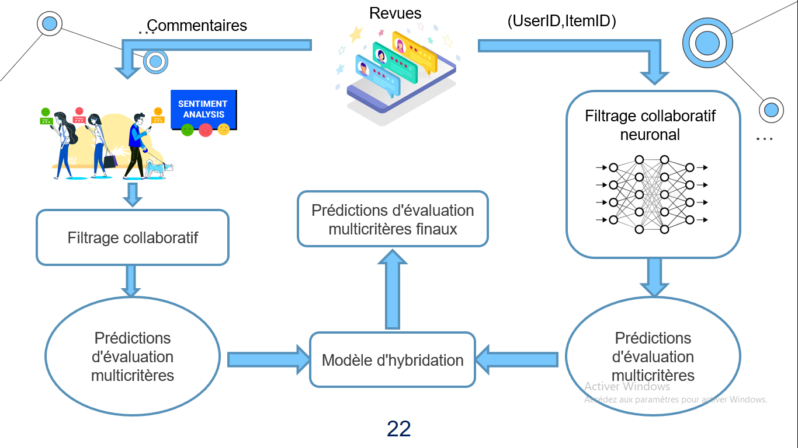
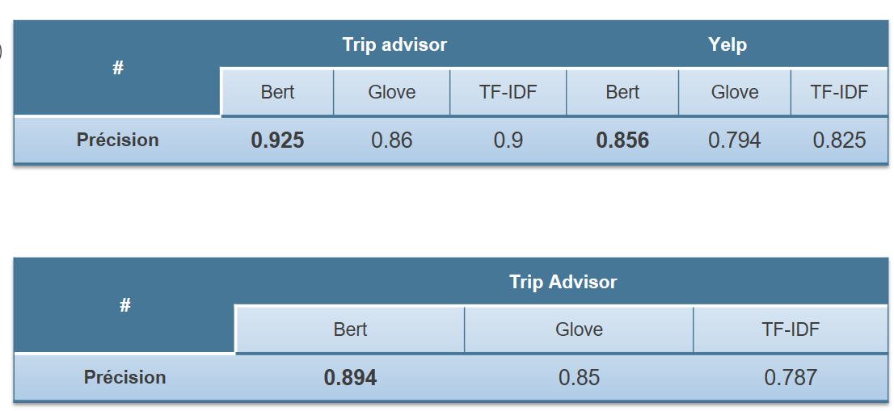

# Hybrid-multi-criteria-recommendation-based-on-multi-aspect-sentiment-analysis

This repository talks about new approach of recommendation system based hybrid model Neural colaboratif filtering and Colaboratif filtering based Multi aspects sentiment analysis.

In this project, me and my teamate reached a new art of state.

<h1>Approach</h1>

<h1>1 Sentimens analysis</h1>  

While our approach uses sentiment analysis scores in calculating similarity between users, we started our project by building sentiment analysis models. 
In order to have a good recommendation system, we must create a very accurated sentiment analysis model, and that's why we tried and fine tuned different approachs. 
As the title of our approach suggests, we developed new sentiment analysis models that predict the user's sentiment on various aspects.

 

<h2>1.1   Tfidf with fully connected layers. </h2>
TF-IDF stands for term frequency-inverse document frequency and it is a measure, used in the fields of information retrieval (IR) and machine learning, that can quantify the importance or relevance of string representations (words, phrases, lemmas, etc) in a document amongst a collection of documents.

The reason of choosing fully connected layer against LSTM is that tfidf does not give any sequential information.  

<h2>1.2 Glove with LSTM </h2>

GloVe is an unsupervised learning algorithm for obtaining vector representations for words. Training is performed on aggregated global word-word co-occurrence statistics from a corpus, and the resulting representations showcase interesting linear substructures of the word vector space  

<h2>1.3  Bert with Bi-LSTM </h2>

BERT, or Bidirectional Encoder Representations from Transformers, is a new method of pre-training language representations which obtains state-of-the-art results on a wide array of Natural Language Processing (NLP) tasks 
We used BERT as a feature extraction model. 

<h2>1.4 Accuracy </h2>  
The table bellow represents the accuracy obtained on Trip Advisor and Yelp datasets, using both sentiments analysis and multi-creteria sentiment analysis. 

